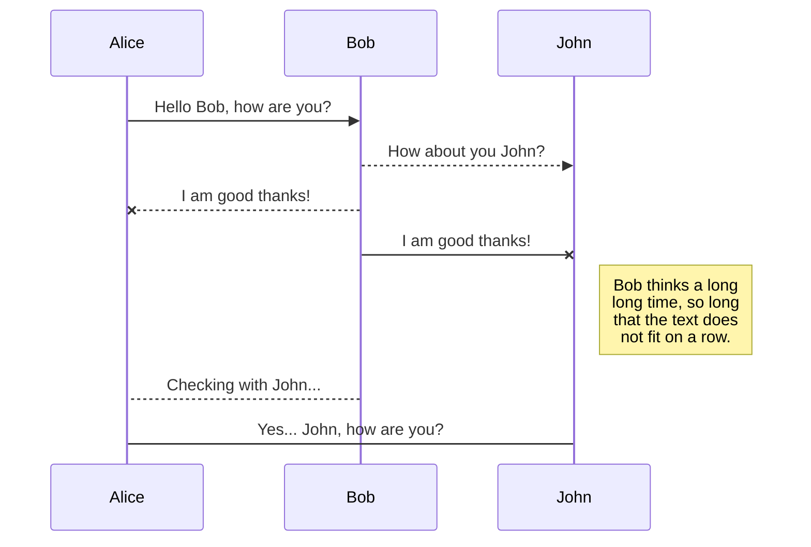
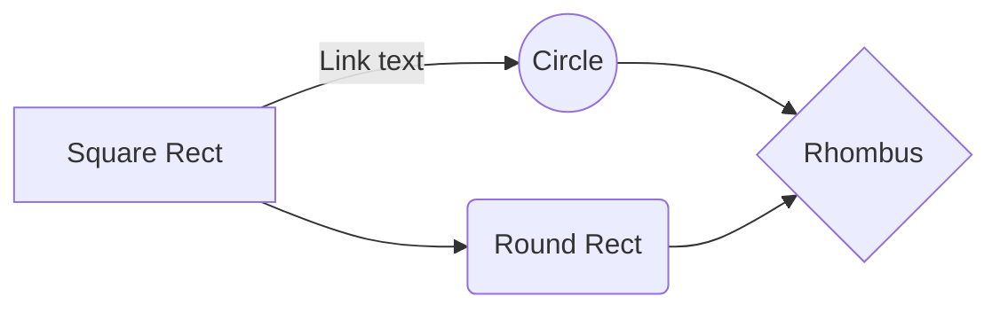

# ***EpcTools*** - Enhanced Packet Core Application Development Tools for Linux
***EpcTools*** is a set of C++ classes that simplifies the development and management of EPC applications.  This library is intended for use on any Linux based system that supports g++ and pthreads.

# Contents
<div class="mycustomlist">
<ol>
	<li>[Dependencies](#dependencies)</li>
	<li>[Installation](#installation)</li>
	<li>[Configuration](#configuration)
		<ol>
		    <li>[Command Line](#configuration-command-line)</li>
		    <li>[Configuration File](#configuration-file)</li>
		</ol>
	</li>
	<li>[Feature Overview](#feature-overview)
		<ol>
			<li>[Public vs. Private](#feature-overview-public-private)</li>
			<li>[Shared Memory](#feature-overview-shared-memory)</li>
			<li>[Threads](#feature-overview-threads)
				<ol>
					<li>[Basic Thread](#feature-overview-threads-basic-thread)</li>
					<li>[Event Thread](#feature-overview-threads-event-thread)
						<ol>
							<li>[Standard Event Message](#feature-overview-threads-event-thread-event-message-standard)</li>
							<li>[Custom Event Message](#feature-overview-threads-event-thread-event-message-custom)</li>
							<li>[Timers](#feature-overview-threads-event-thread-timers)</li>
						</ol>
					</li>
					<li>[Public Event Threads](#feature-overview-threads-public-event-threads)</li>
				</ol>
			</li>
			<li>Message Queue(#feature-overview-message-queue)
				<ol>
					<li>[Pack/Unpack](#feature-overview-message-queue-pack-unpack)</li>
				</ol>
			</li>
			<li>[Synchronization](#feature-overview-synchronization)
				<ol>
					<li>[Mutex](#feature-overview-synchronization-mutex)</li>
					<li>[Semaphore](#feature-overview-synchronization-semaphore)</li>
					<li>[Event](#feature-overview-synchronization-event)</li>
					<li>[Read/Write Lock](#feature-overview-synchronization-read-write-lock)</li>
				</ol>
			</li>
			<li>[Socket Communications](#feature-overview-socket-communications)
				<ol>
					<li>[Socket Thread](#feature-overview-socket-communications-socket-thread)</li>
					<li>[TCP](#feature-overview-socket-communications-tcp)</li>
					<li>[UDP](#feature-overview-socket-communications-udp)</li>
				</ol>
			</li>
			<li>[Logging](#feature-overview-logging)</li>
			<li>[DNS](#feature-overview-dns)
				<ol>
					<li>[Cache](#feature-overview-dns-cache)</li>
					<li>[EPC Node Discovery](#feature-overview-dns-epc-node-discovery)</li>
					<li>[Diameter S-NAPTR](#feature-overview-dns-diameter-s-naptr)</li>
				</ol>
			</li>
			<li>[REST Server](#feature-overview-rest-server)</li>
			<li>[freeDiameter](#feature-overview-freediameter)</li>
			<li>[Interface Statistics](#feature-overview-statistics)</li>
			<li>[Timer Pool](#feature-overview-timer-pool)</li>
			<li>[Miscellaneous](#feature-overview-miscellaneous)
				<ol>
					<li>[String](#feature-overview-miscellaneous-string)</li>
					<li>[Utilities](#feature-overview-miscellaneous-utilities)</li>
					<li>[Time](#feature-overview-miscellaneous-time)</li>
					<li>[Timer](#feature-overview-miscellaneous-timer)</li>
					<li> [Path](#feature-overview-miscellaneous-path)</li>
					<li>[Directory](#feature-overview-miscellaneous-directory)</li>
					<li> [Error](#feature-overview-miscellaneous-error)</li>
					<li>[Hash](#feature-overview-miscellaneous-hash)</li>
					<li>[BZip2](#feature-overview-miscellaneous-bzip2)</li>
					<li>[Circular Buffer](#feature-overview-miscellaneous-circular-buffer)</li>
				</ol>
			</li>
		</ol>
	</li>
</ol>
</div>

<a name="dependencies"></a>
# Dependencies
* [freeDiameter](https://github.com/omec-project/freediameter) - an implementation of the Diameter protocol
* [RapidJSON](http://rapidjson.org) - a JSON parser and generator for C++
* [spdlog](https://github.com/gabime/spdlog) - very fast, header-only/compiled, C++ logging library
* [pistache](http://pistache.io/) - an elegant C++ REST framework
* [bzip2](https://www.sourceware.org/bzip2/) - a freely available, patent free (see below), high-quality data compressor

<a name="installation"></a>
# Installation
***Update your system.***
```sh
    $ sudo apt-get update
```
***Install Ubuntu 16.04 prerequisites.***
```sh
    sudo apt-get install mercurial cmake make gcc g++ bison flex libsctp-dev libgnutls-dev libgcrypt-dev libidn11-dev m4 automake libtool
```
***Install Ubuntu 18.04 prerequisites.***
```sh
    sudo apt-get install mercurial cmake make gcc g++ bison flex libsctp-dev libgnutls28-dev libgcrypt-dev libidn11-dev m4 automake libtool
```
***Clone the project, install the dependencies (via configure), build the static library and install.***
```sh
	$ git clone https://github.com/brianwaters3/FoundationTools.git epctools
	$ cd epctools
	$ git checkout sprint
	$ ./configure
	$ make
	$ sudo make install
```
<a name="feature-overview"></a>
# Feature Overview
<a name="feature-overview-public-private"></a>
## Public vs. Private
For some classes, ***EpcTools*** supports the concept of public classes and private.  A public class/object is one that can be accessed from a different process, while a private class/object can only be accessed from within the current process.  This is achieved by storing the data associated with the public object in shared memory, thereby giving access to the public objects to any process.

***NOTE:*** Since public objects have data stored in shared memory, each application that wants to have access to the public object must enable the EpcTools/EnablePublicObjects configuration option to TRUE.  By default, the EpcTools/EnablePublicObjects configuration option is `FALSE`.  Additionally, if an application does not call [EpcTools::UnInitialize()](@ref EpcTools::UnInitialize) prior to exiting, the objects in shared memory will be remain until the shared memory is released.  ***This condition can lead to unexpected/unexplained application behavior.***

The classes that support public/private are:
| Public | Private | Description |
| :------- | :--------- | :----------- |
| [EMutexPublic](@ref EMutexPublic) | [EMutexPrivate](@ref EMutexPrivate) | A mutex (mutual exclusion object) is a program object that is created so that multiple threads can take turns sharing the same resource, such as a file or list. An application can attach to a public mutex specifying the mutex ID when calling the [attach()](@ref EMutexPublic::attach) method.|
| [ESemaphorePublic](@ref ESemaphorePublic) | [ESemaphorePrivate](@ref ESemaphorePrivate) | A semaphore is simply a variable which is non-negative and shared between threads. The ***EpcTools*** semaphore is what is considered a counting semaphore. Semaphores are used internally in ***EpcTools*** as part of various queue implementations to represent the number of messages in the queue.  If you attempt to read a queue that is empty, the semaphore will block until a message has been added to the queue.  An application can attach to a public semaphore by specifying the semaphore ID when calling the [attach()](@ref ESemaphorePublic::attach) method.|
| [EQueuePublic](@ref EQueuePublic) | [EQueuePrivate](@ref EQueuePrivate) | A message queue is a FIFO (first in first out) list of messages.  Since these messages may be shared across processes, pointer values are not allowed.  A message class derived from [EMessage](@ref EMessage) provides utilities to pack and unpack data that can be written to and read from a queue.  An application can attach to a public queue by specifying the queue ID when calling the [init()](@ref EQueuePublic::init) method.|
| [EThreadPublic](@ref EThreadPublic) | [EThreadPrivate](@ref EThreadPrivate) | A thread provides multiple threads of execution within the same program in a shared memory address space.  Threads allow for concurrent programming and, on multiple processor/core systems, true parallelism.  To send an event message to a public thread from a different process, the application must first create an instance of [EThreadPublic](@ref EThreadPublic) that refers to the same application ID and thread ID that the target thread was initialized with. |

<a name="feature-overview-shared-memory"></a>
## Shared Memory
Inter process communication through shared memory is a concept where two or more processes can access the common memory and changes to the shared memory made by one process can viewed (and changed) by another process.  The [ESharedMemory](@ref ESharedMemory) class provides functionality to allocate, access and release a shared memory block.  Once created, a pointer to the shared memory can be retrieved using the [getDataPtr()](@ref ESharedMemory::getDataPtr) method.  Concurrent access to the shared memory should be controlled via an instance of [EMutexPublic](@ref EMutexPublic).

```cpp
....
    ESharedMemory sm;
    sm.init( "/tmp/sm1", 1, 1048576 );
    void *p = sm.getDataPtr();
....
```

This example either creates or attaches to the shared memory identified by the file `"/tmp/sm1"` and a shared memory ID of 1 and is 1MB in size.  The variable `p` is assigned the first address of the 1MB shared memory block.  When `sm` goes out of scope, the shared memory will be released if no other clients are attached.

<a name="feature-overview-threads"></a>
## Threads
<a name="feature-overview-threads-basic-thread"></a>
### Basic Thread
A basic thread is a thread wrapper that will execute a user provided procedure/function in a separate thread.  The basic thread is defined by deriving a class from [EThreadBasic](@ref EThreadBasic) and overloading the `threadProc()` method. To initialize and start the thread simply call the `init(pVoid arg, Dword stackSize = 0)` method.  Call [join()](@ref EThreadBasic::join) to wait for the thread to exit.  Other useful [EThreadBasic](@ref EThreadBasic) methods include [sleep(Int milliseconds)](@ref EThreadBasic::sleep) and [yield()](@ref EThreadBasic::yield).

In this example, a basic thread is defined in the class `EThreadBasicTest`.
```cpp
class EThreadBasicTest : public EThreadBasic {
public:
   EThreadBasicTest() : m_timetoquit(false) {}

   Dword threadProc(Void *arg) {
      while (!m_timetoquit) {
         cout << "Inside the thread [" << (cpStr)arg << "]" << endl;
         sleep(1000);
      }
      cout << "Exiting EThreadTest::threadProc()" << endl;
      return 0;
   }

   Void setTimeToQuit() {
      m_timetoquit = true;
   }

private:
   bool m_timetoquit;
};

Void EThreadBasic_test() {
   cout << "EThread_test() Start" << endl;

   EThreadBasicTest t;

   t.init((Void *)"this is the thread argument");
   cout << "before 5 second sleep sleep" << endl;
   t.sleep(5000);
   cout << "before setTimeToQuit()" << endl;
   t.setTimeToQuit();
   cout << "before join" << endl;
   t.join();

   cout << "EThread_test() Complete" << endl;
}
```

<a name="feature-overview-threads-event-thread"></a>
### Event Thread
An event thread is derived from either [EThreadPrivate](@ref EThreadPrivate) or [EThreadPublic](@ref EThreadPublic).  An event based thread maintains an internal event message queue.  Event messages are added to the event queue using one of the [sendMessage()](@ref EThreadBase::sendMessage) methods.  [sendMessage()](@ref EThreadBase::sendMessage) can be called from any thread.  Internally, the event thread blocks waiting for an event message to be added to the event message queue.  When an event message appears in the event queue, the message is dequeued and the appropriate handler is identified and executed.  The association between event ID's and handlers is defined in a message map.
```cpp
BEGIN_MESSAGE_MAP(EThreadTest, EThreadPrivate)
	ON_MESSAGE(EM_USER1, EThreadTest::userFunc1)
	ON_MESSAGE(EM_USER2, EThreadTest::userFunc2)
END_MESSAGE_MAP()
```
In this example, `EThreadTest` is derived from [EThreadPrivate](@ref EThreadPrivate)  and there are two event handlers defined in `EThreadTest`: `userFunc1()` and `userFunc2()`.  According to the message map, when event `EM_USER1` is received, the dispatcher will call `userFunc1()` and when `EM_USER2` is received, the dispatcher will call `userFunc2()`.

The event dispatcher searches the message map looking for the event ID.  If the event ID is not found, the dispatcher will then search the parent class which is the second parameter in the `BEGIN_MESSAGE_MAP` macro.  This process will continue until a handler is identified or there are no more base classes to evaluate.  In this case, the [defMessageHandler()](@ref EThreadBase) will be called to process the message.
```cpp
class EThreadTestParent : EThreadPrivate {
	....
	Void userFunc1(EThreadMessage &msg);
	Void userFunc2(EThreadMessage &msg);
	....
};

BEGIN_MESSAGE_MAP(EThreadTestParent, EThreadPrivate)
	ON_MESSAGE(EM_USER1, EThreadTestParent::userFunc1)
	ON_MESSAGE(EM_USER2, EThreadTestParent::userFunc2)
END_MESSAGE_MAP()

class EThreadTestChild : public EThreadTestParent {
	....
	Void childUserFunc1(EThreadMessage &msg);
	....
};

BEGIN_MESSAGE_MAP(EThreadTestChild, EThreadTestParent)
	ON_MESSAGE(EM_USER1, EThreadTestChild::childUserFunc1)
END_MESSAGE_MAP()
```
This example demonstrates the inheritance behavior of the event dispatcher.  When an instance of `EThreadTestParent` is created and `EM_USER1` is sent to it, `EThreadTestParent::userFunc1()` will be called to process the event.  Similarly, when an instance of `EThreadTestChild` is created and `EM_USER1` is sent to it, `EThreadTestChild::childUserFunc1()` will be called.  Finally, when `EM_USER2` is sent to the instance of `EThreadTestChild`, the event dispatcher will call `EThreadTestParent::userFunc2()` to process the event message since there isn't an event handler defined in `EThreadTestChild` to process `EM_USER2`.

In addition to custom event message handlers, the dispatcher also identifies special events including `EM_INIT`, `EM_QUIT`, `EM_SUSPEND` and `EM_TIMER`.  When one of these events is identified, the corresponding method will be called ([onInit()](@ref EThreadBase::onInit), [onQuit()](@ref EThreadBase::onQuit), [onSuspend()](@ref EThreadBase::onSuspend) and [onTimer()](@ref EThreadBase::onTimer)).


<a name="feature-overview-threads-event-thread-event-message-standard"></a>
#### Standard Event Message

<a name="feature-overview-threads-event-thread-event-message-custom"></a>
#### Custom Event Message

<a name="feature-overview-threads-event-thread-timers"></a>
#### Timers


<a name="feature-overview-threads-public-event-threads"></a>
### Public Event Threads
The benefit of a public event thread over a private event thread is that thread event messages can be sent from a thread in one process to a thread in another process.  This is achieved by storing the event message queue in shared memory.  When a process creates an instance of a class derived from EThreadPublic the [init()](@ref EThreadPublic::init) is called with an application ID and thread ID.  These ID's are used to locate the public event message queue in shared memory.  If the specified application ID and thread ID do not exist in shared memory when [init()](@ref EThreadPublic::init) is called, then the thread is created in the current process and the thread's event message queue is created in shared memory.  If the application ID and thread ID are found in shared memory, then thread object attaches to the public event queue and no local thread is created.

Here is sample code for the application that will host the public thread.
```cpp
#define EVENT1 (EM_USER + 1)
class MyThread : public EThreadPublic {
public:
	....
	Void eventHandler1(EThreadMessage &msg);
	....
};

....
	MyThread t;
	t.init(/*application id*/ 1, /*thread id*/ 1);
....
```

And here is sample code for the application that will send event messages.
```cpp
#define EVENT1 (EM_USER + 1)

....
	EThreadPublic t;
	t.init(/*application id*/ 1, /*thread id*/ 1);
....
	t.sendMessage(EVENT1);
....
```

You will notice that the thread in the second example is an instance of [EThreadPublic](@ref EThreadPublic) while the thread in the first example is an instance of `MyThread`.  This is because the thread object in the second example will only be used to send event messages, it will not be processing any events, therefore it doesn't need any event handlers.

***NOTE:*** The order that these two applications are started is very important.  The first application to start will host the thread and in this case we would want the code in the first example to be started first.

<a name="feature-overview-message-queue"></a>
## Message Queue

<a name="feature-overview-message-queue-pack-unpack"></a>
### Pack/Unpack

<a name="feature-overview-synchronization"></a>
## Synchronization

<a name="feature-overview-synchronization-mutex"></a>
### Mutex

<a name="feature-overview-synchronization-semaphore"></a>
### Semaphore

<a name="feature-overview-synchronization-event"></a>
### Event

<a name="feature-overview-synchronization-read-write-lock"></a>
### Read/Write Lock

<a name="feature-overview-socket-communications"></a>
## Socket Communications
Asynchronous socket communications is supported by ***EpcTools*** in the ESocket namespace.  Currently, support for IPv4 and IPv6 with both TCP and UDP have been implemented.  The framework can be enhanced to support additional socket types such as Unix domain socket.
 
<a name="feature-overview-socket-communications-socket-thread"></a>
### Socket Thread
[ESocket::Thread](@ref ESocket::Thread) is derived from EThreadPrivate and has a custom message pump and dispatcher to identify and process socket events for sockets that are registered with the socket thread.  The message pump function utilizes `select()` to detect when a socket can be read from, written to or when an error has occurred.  These events are then dispatched to appropriate callback methods depending on the role and state of the socket.

In addition to processing socket events [ESocket::Thread](@ref ESocket::Thread) is also capable of processing standard event messages.  See [Event Thread](#feature-overview-threads-event-thread) for more information.

<a name="feature-overview-socket-communications-tcp"></a>
### TCP
TCP is a streaming connection based protocol.  As such, a TCP application will either act as a client (connects to a server) or as a server (accepts connections from clients).  The [ESocket::TCP](@ref ESocket::TCP) namespace contains the class definitions used by the client and server applications.

A server application listens for incoming connections using a class derived from [TCP::Listener](@ref ESocket::TCP::Listener).  When the listener detects an incoming connection, the [TCP::Listener::createSocket()](@ref ESocket::TCP::Listener::createSocket) will be called to create an instance of a class derived from [TCP::Talker](@ref ESocket::TCP::Talker) that will be used to received data from and send data to the client.

Conversely, a client application initiates a connection to a server by calling the [connect()](@ref ESocket::TCP::Talker::connect) method with the IP address, IPv4 or IPv6, and port of the server.  When the connection is complete, the [onConnect()](@ref ESocket::TCP::Talker::onConnect) method of the socket object will be called by the dispatcher indicating that the connection is up and communication can proceed.

**[TCP::Listener](@ref ESocket::TCP::Listener) Events**
| Event | Callback Method | Description |
| ------- | -------------------- | :----------- |
| Read |[TCP::Talker::onConnect](@ref ESocket::TCP::Talker::onConnect) | A listening socket will indicate that it can be read from when a new client connects.  The internals will create a new [TCP::Talker](@ref ESocket::TCP::Talker) object to handle the new connection by calling the [TCP::Listener::createSocket()](@ref ESocket::TCP::Listener::createSocket) method.  Once the talking object has been created, the dispatcher will then call the [TCP::Talker::onConnect()](@ref ESocket::TCP::Talker::onConnect) method to start communication with the new client.
| Write | None | This event is not applicable to a listening socket.
| Error | [TCP::Listener::onError](@ref ESocket::TCP::Listener::onError) | Indicates that an error has occurred on the socket while listening for new connections.

**[TCP::Talker](@ref ESocket::TCP::Listener) Events**
| Event | Callback Method | Description |
| ------- | -------------------- | :----------- |
| Read | [TCP::Talker::onReceive](@ref ESocket::TCP::Talker::onReceive)<br>[TCP::Talker::onClose](@ref ESocket::TCP::Talker::onClose) | When a talking socket indicates that it can be read, the framework calls `recv()` to read any pending data.  If zero bytes are read, the socket has been closed and the dispatcher will call the [TCP::Talker::onClose()](@ref ESocket::TCP::Talker::onClose) method.  If more than zero bytes are read, the data is inserted it into an internal receive buffer and the dispatcher will call the [TCP::Talker::onReceive()](@ref ESocket::TCP::Talker::onReceive) method allowing the application to process the data that has been read. |
| Write | None | The framework processes the write event by attempting to send any unsent data to the peer.  No application interaction is required to process this event. |
| Error | [TCP::Talker::onError](@ref ESocket::TCP::Talker::onError) | Indicates that an error has occurred on the socket.

<a name="feature-overview-socket-communications-udp"></a>
### UDP
**[UDP](@ref ESocket::UDP) Events**
| Event | Callback Method | Description |
| ------- | -------------------- | :----------- |
| Read | [UDP::onReceive](@ref ESocket::UDP::onReceive) | When a UDP socket indicates that it can be read, the framework calls `recvfrom()` to read any pending data.  If more than zero bytes are read, the data is inserted it into an internal receive buffer and the dispatcher will call the [UDP::onReceive()](@ref ESocket::UDP::onReceive) method allowing the application to process the data that has been read. |
| Write | None | The framework processes the write event by sending any unsent messages to the destination.  No application interaction is required to process this event. |
| Error | [UDP::onError](@ref ESocket::UDP::onError) | Indicates that an error has occurred on the socket.

	-# [Logging](#feature-overview-logging)
	-# [DNS](#feature-overview-dns)
		-# [Cache](#feature-overview-dns-cache)
		-# [EPC Node Discovery](#feature-overview-dns-epc-node-discovery)
		-# [Diameter S-NAPTR](#feature-overview-dns-diameter-s-naptr)
	-# [REST Server](#feature-overview-rest-server)
	-# [freeDiameter](#feature-overview-freediameter)
	-# [Interface Statistics](#feature-overview-statistics)
	-# [Timer Pool](#feature-overview-timer-pool)
	-# [Miscellaneous](#feature-overview-miscellaneous)
		-# [String](#feature-overview-miscellaneous-string)
		-# [Utilities](#feature-overview-miscellaneous-utilities)
		-# [Time](#feature-overview-miscellaneous-time)
		-# [Timer](#feature-overview-miscellaneous-timer)
		-# [Path](#feature-overview-miscellaneous-path)
		-# [Directory](#feature-overview-miscellaneous-directory)
		-# [Error](#feature-overview-miscellaneous-error)
		-# [Hash](#feature-overview-miscellaneous-hash)
		-# [BZip2](#feature-overview-miscellaneous-bzip2)
		-# [Circular Buffer](#feature-overview-miscellaneous-circular-buffer)

<a name="feature-overview-logging"></a>
## Logging
<a name="feature-overview-dns"></a>
## DNS
<a name="feature-overview-dns-cache"></a>
### DNS Cache
<a name="feature-overview-dns-epc-node-discovery"></a>
### EPC Node Discovery
<a name="feature-overview-dns-diameter"></a>
### Diameter S-NAPTR
<a name="feature-overview-"></a>
## REST Server
<a name="feature-overview-"></a>
## freeDiameter
<a name="feature-overview-"></a>
## Interface Statistics
<a name="feature-overview-"></a>
## Timer Pool
<a name="feature-overview-"></a>
## Miscellaneous
<a name="feature-overview-"></a>
### String
<a name="feature-overview-"></a>
### Utilities
<a name="feature-overview-"></a>
### Time
<a name="feature-overview-"></a>
### Timer
<a name="feature-overview-"></a>
### Path
<a name="feature-overview-"></a>
### Directory
<a name="feature-overview-"></a>
### Error
<a name="feature-overview-"></a>
### Hash
<a name="feature-overview-"></a>
### BZip2
<a name="feature-overview-"></a>
### Circular Buffer


### Socket Thread
A socket thread is derived from an event thread.  The socket thread has a custom message pump and dispatcher to identify and process any socket event for sockets that are registered with the current socket thread.  The message pump function utilizes `select()` to detect the various events associated with the registered sockets.with the addition that it can detect and process socket events.  This is achieved with a specialized message pump that also capable of 

	- Event Based Thread
		- Each thread maintains an internal event queue
		- User defined event handlers
  - Thread based timers
  - Private thread - can only be sent events from threads within the same process
  - Public thread - can be sent events from the same or different processes
 

 - Asynchronous IP communications
    - TCP with both "listener" and "talker" classes
    - UDP support
    - IPv4 and IPv6 address support
    - Socket events are processed from within an event based socket thread
  - Cached DNS client
    - Supports multiple DNS caches, with each DNS cache being associated with one or more named servers
    - Support for 3GPP Domain Name System Procedures as defined in TS 29.303
    - Support for Diameter DNS usage as defined in RFC 6408
    - Automated refresh of the cache
    - "Priming" the cache at startup based on previous usage
  - Configuration
    - Command line options
        - Named options that require an additional typed argument
        - Named options with out additional arguments (boolean)
        - Positional arguments
    - JSON configuration file(s)
        - Supports a heirarchial definition of configuration options
        - Supports array(s) of options
        - Multiple configuration files can be loaded
  - REST Based Management Interface
    - A REST based interface for processing external commands
        - Extensible user defined handlers (for different commands)
        - Can support multiple REST servers
  - freeDiameter Support
    - Supports 1 or more active Diameter applications
    - Simplified interface for creating messages and adding AVP's
    - Extractor classes that eliminate the need to manually extract AVP values
    - Peer management

  - Synchronization - Mutex using native IPC (pthread) or custom mutex implementation and an optimized Semaphore implementation
  - Custom queue implementation with message encoding and decoding
  - Shared Memory configuration and access
  - Ability to enable or disable public variants of threads, mutexes, semaphores and queues that utilize shared memory
  - Various utility classes including circular buffer, directory processing, bzip2, time, elapsed timer, string, exception and logging

<a name="dependencies"></a>
# Dependencies
* [freeDiameter](https://github.com/omec-project/freediameter) - an implementation of the Diameter protocol
* [RapidJSON](http://rapidjson.org) - a JSON parser and generator for C++
* [spdlog](https://github.com/gabime/spdlog) - very fast, header-only/compiled, C++ logging library
* [pistache](http://pistache.io/) - an elegant C++ REST framework
* [bzip2](https://www.sourceware.org/bzip2/) - a freely available, patent free (see below), high-quality data compressor

<a name="installation"></a>
# Installation
Clone the project, install the dependencies (via configure), build the static library and install.
```sh
	$ sudo apt-get update
	$ sudo apt-get install mercurial cmake make gcc g++ bison flex libsctp-dev libgnutls-dev libgcrypt-dev libidn11-dev m4 automake
	$ git clone https://github.com/brianwaters3/FoundationTools.git epctools
	$ cd epctools
	$ git checkout sprint
	$ ./configure
	$ make
	$ sudo make install
```


## Threading

### Basic Thread

To create a basic thread, an object must be derived from `EThreadBasic` overriding the `EThreadBasic::threadProc()` method which represents the code that will be executed in a separate thread.  To initialize and start the thread simply call the `Void init(pVoid arg, Dword stackSize = 0)` method.  Call `Void join()` to wait for the thread to exit.  Other useful `EThreadBasic` methods include `static Void sleep(Int milliseconds)` and `static Void yield()`.

```cpp
class EThreadBasicTest : public EThreadBasic
{
public:
   EThreadBasicTest() : m_timetoquit(false) {}

   Dword threadProc(Void *arg) {
      while (!m_timetoquit) {
         cout << "Inside the thread [" << (cpStr)arg << "]" << endl;
         sleep(1000);
      }
      cout << "Exiting EThreadTest::threadProc()" << endl;
      return 0;
   }

   Void setTimeToQuit() {
      m_timetoquit = true;
   }

private:
   bool m_timetoquit;
};

Void EThreadBasic_test() {
   cout << "EThread_test() Start" << endl;

   EThreadBasicTest t;

   t.init((Void *)"this is the thread argument");
   cout << "before 5 second sleep sleep" << endl;
   t.sleep(5000);
   cout << "before setTimeToQuit()" << endl;
   t.setTimeToQuit();
   cout << "before join" << endl;
   t.join();

   cout << "EThread_test() Complete" << endl;
}
```
### Event Thread

### Socket Thread (TCP)

## Synchronization

### Mutex

### Semaphore

## Queue

### Configuration

### Encode/Decode

## Shared Memory

## Configuration

## Exceptions

## Logger


### Tech

Dillinger uses a number of open source projects to work properly:

* [AngularJS] - HTML enhanced for web apps!
* [Ace Editor] - awesome web-based text editor
* [markdown-it] - Markdown parser done right. Fast and easy to extend.
* [Twitter Bootstrap] - great UI boilerplate for modern web apps
* [node.js] - evented I/O for the backend
* [Express] - fast node.js network app framework [@tjholowaychuk]
* [Gulp] - the streaming build system
* [Breakdance](http://breakdance.io) - HTML to Markdown converter
* [jQuery] - duh

And of course Dillinger itself is open source with a [public repository][dill]
 on GitHub.

### Installation

Dillinger requires [Node.js](https://nodejs.org/) v4+ to run.

Install the dependencies and devDependencies and start the server.

```sh
$ git clone https://github.com/brianwaters3/FoundationTools.git epctools
$ cd epctools
$ ./configure
```

For production environments...

```sh
$ npm install --production
$ NODE_ENV=production node app
```

### Plugins

Dillinger is currently extended with the following plugins. Instructions on how to use them in your own application are linked below.

| Plugin | README |
| ------ | ------ |
| Dropbox | [plugins/dropbox/README.md][PlDb] |
| Github | [plugins/github/README.md][PlGh] |
| Google Drive | [plugins/googledrive/README.md][PlGd] |
| OneDrive | [plugins/onedrive/README.md][PlOd] |
| Medium | [plugins/medium/README.md][PlMe] |
| Google Analytics | [plugins/googleanalytics/README.md][PlGa] |


### Development

Want to contribute? Great!

Dillinger uses Gulp + Webpack for fast developing.
Make a change in your file and instantanously see your updates!

Open your favorite Terminal and run these commands.

First Tab:
```sh
$ node app
```

Second Tab:
```sh
$ gulp watch
```

(optional) Third:
```sh
$ karma test
```
#### Building for source
For production release:
```sh
$ gulp build --prod
```
Generating pre-built zip archives for distribution:
```sh
$ gulp build dist --prod
```
### Docker
Dillinger is very easy to install and deploy in a Docker container.

By default, the Docker will expose port 8080, so change this within the Dockerfile if necessary. When ready, simply use the Dockerfile to build the image.

```sh
cd dillinger
docker build -t joemccann/dillinger:${package.json.version} .
```
This will create the dillinger image and pull in the necessary dependencies. Be sure to swap out `${package.json.version}` with the actual version of Dillinger.

Once done, run the Docker image and map the port to whatever you wish on your host. In this example, we simply map port 8000 of the host to port 8080 of the Docker (or whatever port was exposed in the Dockerfile):

```sh
docker run -d -p 8000:8080 --restart="always" <youruser>/dillinger:${package.json.version}
```

Verify the deployment by navigating to your server address in your preferred browser.

```sh
127.0.0.1:8000
```

#### Kubernetes + Google Cloud

See [KUBERNETES.md](https://github.com/joemccann/dillinger/blob/master/KUBERNETES.md)


### Todos

 - Write MORE Tests
 - Add Night Mode

License
----

MIT


**Free Software, Hell Yeah!**

[//]: # (These are reference links used in the body of this note and get stripped out when the markdown processor does its job. There is no need to format nicely because it shouldn't be seen. Thanks SO - http://stackoverflow.com/questions/4823468/store-comments-in-markdown-syntax)


   [dill]: <https://github.com/joemccann/dillinger>
   [git-repo-url]: <https://github.com/joemccann/dillinger.git>
   [john gruber]: <http://daringfireball.net>
   [df1]: <http://daringfireball.net/projects/markdown/>
   [markdown-it]: <https://github.com/markdown-it/markdown-it>
   [Ace Editor]: <http://ace.ajax.org>
   [node.js]: <http://nodejs.org>
   [Twitter Bootstrap]: <http://twitter.github.com/bootstrap/>
   [jQuery]: <http://jquery.com>
   [@tjholowaychuk]: <http://twitter.com/tjholowaychuk>
   [express]: <http://expressjs.com>
   [AngularJS]: <http://angularjs.org>
   [Gulp]: <http://gulpjs.com>

   [PlDb]: <https://github.com/joemccann/dillinger/tree/master/plugins/dropbox/README.md>
   [PlGh]: <https://github.com/joemccann/dillinger/tree/master/plugins/github/README.md>
   [PlGd]: <https://github.com/joemccann/dillinger/tree/master/plugins/googledrive/README.md>
   [PlOd]: <https://github.com/joemccann/dillinger/tree/master/plugins/onedrive/README.md>
   [PlMe]: <https://github.com/joemccann/dillinger/tree/master/plugins/medium/README.md>
   [PlGa]: <https://github.com/RahulHP/dillinger/blob/master/plugins/googleanalytics/README.md>


# Welcome to StackEdit!

Hi! I'm your first Markdown file in **StackEdit**. If you want to learn about StackEdit, you can read me. If you want to play with Markdown, you can edit me. Once you have finished with me, you can create new files by opening the **file explorer** on the left corner of the navigation bar.


# Files

StackEdit stores your files in your browser, which means all your files are automatically saved locally and are accessible **offline!**

## Create files and folders

The file explorer is accessible using the button in left corner of the navigation bar. You can create a new file by clicking the **New file** button in the file explorer. You can also create folders by clicking the **New folder** button.

## Switch to another file

All your files and folders are presented as a tree in the file explorer. You can switch from one to another by clicking a file in the tree.

## Rename a file

You can rename the current file by clicking the file name in the navigation bar or by clicking the **Rename** button in the file explorer.

## Delete a file

You can delete the current file by clicking the **Remove** button in the file explorer. The file will be moved into the **Trash** folder and automatically deleted after 7 days of inactivity.

## Export a file

You can export the current file by clicking **Export to disk** in the menu. You can choose to export the file as plain Markdown, as HTML using a Handlebars template or as a PDF.


# Synchronization

Synchronization is one of the biggest features of StackEdit. It enables you to synchronize any file in your workspace with other files stored in your **Google Drive**, your **Dropbox** and your **GitHub** accounts. This allows you to keep writing on other devices, collaborate with people you share the file with, integrate easily into your workflow... The synchronization mechanism takes place every minute in the background, downloading, merging, and uploading file modifications.

There are two types of synchronization and they can complement each other:

- The workspace synchronization will sync all your files, folders and settings automatically. This will allow you to fetch your workspace on any other device.
	> To start syncing your workspace, just sign in with Google in the menu.

- The file synchronization will keep one file of the workspace synced with one or multiple files in **Google Drive**, **Dropbox** or **GitHub**.
	> Before starting to sync files, you must link an account in the **Synchronize** sub-menu.

## Open a file

You can open a file from **Google Drive**, **Dropbox** or **GitHub** by opening the **Synchronize** sub-menu and clicking **Open from**. Once opened in the workspace, any modification in the file will be automatically synced.

## Save a file

You can save any file of the workspace to **Google Drive**, **Dropbox** or **GitHub** by opening the **Synchronize** sub-menu and clicking **Save on**. Even if a file in the workspace is already synced, you can save it to another location. StackEdit can sync one file with multiple locations and accounts.

## Synchronize a file

Once your file is linked to a synchronized location, StackEdit will periodically synchronize it by downloading/uploading any modification. A merge will be performed if necessary and conflicts will be resolved.

If you just have modified your file and you want to force syncing, click the **Synchronize now** button in the navigation bar.

> **Note:** The **Synchronize now** button is disabled if you have no file to synchronize.

## Manage file synchronization

Since one file can be synced with multiple locations, you can list and manage synchronized locations by clicking **File synchronization** in the **Synchronize** sub-menu. This allows you to list and remove synchronized locations that are linked to your file.


# Publication

Publishing in StackEdit makes it simple for you to publish online your files. Once you're happy with a file, you can publish it to different hosting platforms like **Blogger**, **Dropbox**, **Gist**, **GitHub**, **Google Drive**, **WordPress** and **Zendesk**. With [Handlebars templates](http://handlebarsjs.com/), you have full control over what you export.

> Before starting to publish, you must link an account in the **Publish** sub-menu.

## Publish a File

You can publish your file by opening the **Publish** sub-menu and by clicking **Publish to**. For some locations, you can choose between the following formats:

- Markdown: publish the Markdown text on a website that can interpret it (**GitHub** for instance),
- HTML: publish the file converted to HTML via a Handlebars template (on a blog for example).

## Update a publication

After publishing, StackEdit keeps your file linked to that publication which makes it easy for you to re-publish it. Once you have modified your file and you want to update your publication, click on the **Publish now** button in the navigation bar.

> **Note:** The **Publish now** button is disabled if your file has not been published yet.

## Manage file publication

Since one file can be published to multiple locations, you can list and manage publish locations by clicking **File publication** in the **Publish** sub-menu. This allows you to list and remove publication locations that are linked to your file.


# Markdown extensions

StackEdit extends the standard Markdown syntax by adding extra **Markdown extensions**, providing you with some nice features.

> **ProTip:** You can disable any **Markdown extension** in the **File properties** dialog.


## SmartyPants

SmartyPants converts ASCII punctuation characters into "smart" typographic punctuation HTML entities. For example:

|                |ASCII                          |HTML                         |
|----------------|-------------------------------|-----------------------------|
|Single backticks|`'Isn't this fun?'`            |'Isn't this fun?'            |
|Quotes          |`"Isn't this fun?"`            |"Isn't this fun?"            |
|Dashes          |`-- is en-dash, --- is em-dash`|-- is en-dash, --- is em-dash|


## KaTeX

You can render LaTeX mathematical expressions using [KaTeX](https://khan.github.io/KaTeX/):

The *Gamma function* satisfying $\Gamma(n) = (n-1)!\quad\forall n\in\mathbb N$ is via the Euler integral

$$
\Gamma(z) = \int_0^\infty t^{z-1}e^{-t}dt\,.
$$

> You can find more information about **LaTeX** mathematical expressions [here](http://meta.math.stackexchange.com/questions/5020/mathjax-basic-tutorial-and-quick-reference).


## UML diagrams

You can render UML diagrams using [Mermaid](https://mermaidjs.github.io/). For example, this will produce a sequence diagram:



And this will produce a flow chart:

